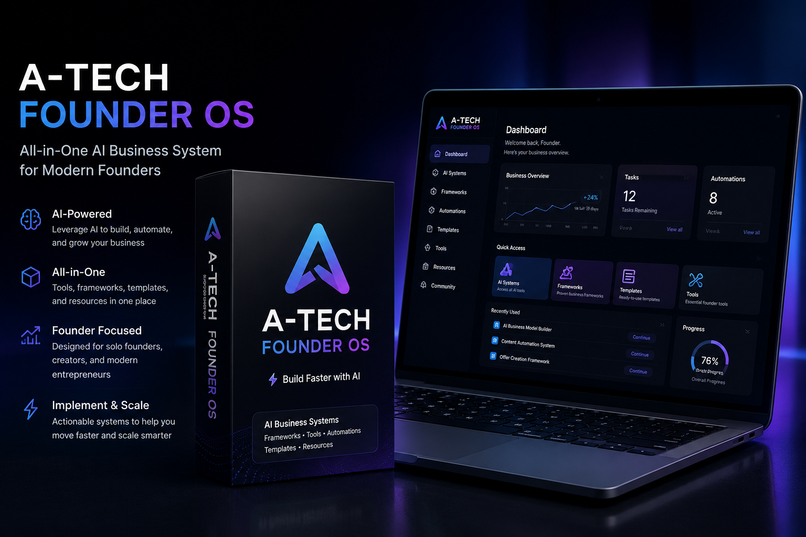
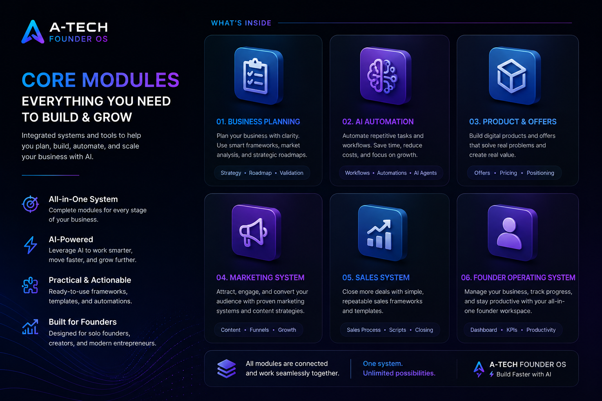
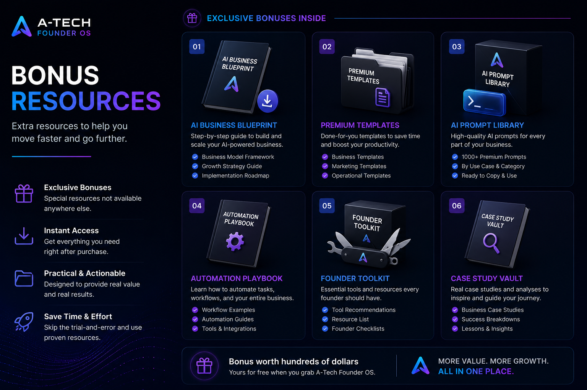
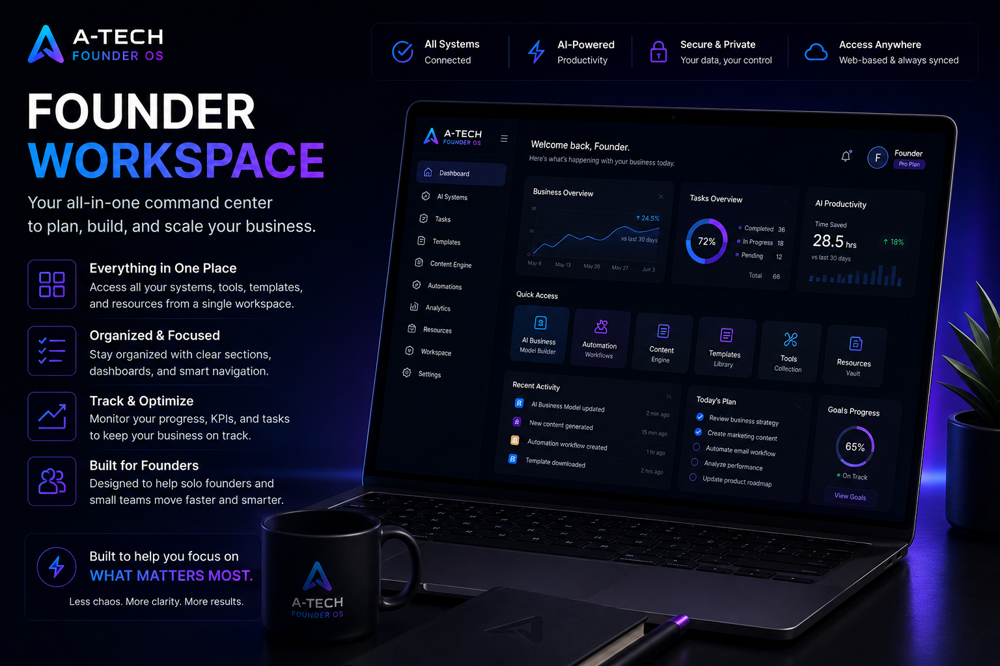

# A-Tech Labs

AI business systems & automation tools for modern founders.

---

## What We Build

A-Tech Labs builds practical AI-powered business systems to help founders launch, automate, and scale faster.

Our focus:

- AI automation workflows
- founder productivity systems
- prompt frameworks
- digital business operating systems
- validation & offer creation systems

---

## Featured Product

# A-Tech Founder OS

All-in-one AI business operating system for founders.

Designed to help solo founders and digital entrepreneurs:

✅ validate ideas faster  
✅ build offers faster  
✅ automate repetitive workflows  
✅ improve productivity with AI systems  
✅ launch faster with ready-to-use frameworks  

---

## Product Preview

### Founder OS Hero

### Core Modules

### Bonus Resources

### Founder Workspace

---

## Tech Direction

Current stack exploration:

- AI workflow systems
- automation infrastructure
- prompt engineering frameworks
- digital founder tools
- scalable SaaS systems

---

## Contact

TikTok: https://tiktok.com/@atechlabs

Product Access:
https://clicky.id/atechlabs

---

Built by A-Tech Labs
